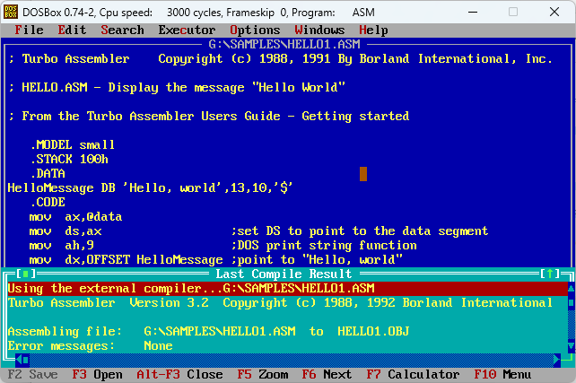

# Assembler IDE

Assembler IDE is a visual wrapper for TASM/TLink, written in Pascal.

It was developed in 1995-1996 as a showcase for a course/lab at university (Universitatea Politehnica Timisoara). Can't recall which course, though :)

At that time, I had taken up an interest in x86 assembler and thought an IDE would be speed up development.

Unfortunately, there wasn't much interest for it at that time for me to invest time into it, so I've eventually abandoned it.

A few assembler source code programs have been included in the [samples](original-dos/samples) folder, including Little, my first intro written completely in assembler.

## Help
If you're familiar with the Borland IDE, all the editing shortcuts are the same.

It's advised to File > Change Dir before opening a file not in the same folder as the AsmIde executable, otherwise it'll throw an error. It's either a coding mistake on my part or some weird behaviour of Turbo Vision, more likely the former.

Original release notes in English and Romanian are included in the [doc](original-dos/doc) folder. Please excuse the cringe ;)

## TODO
* build with FPC
* add support for multiple assembler toolchains
* detect assembler source code style (TASM, MASM, NASM) and choose the assembler toolchain accordingly
* improved support for error navigation

## License

Code license:
https://opensource.org/licenses/MIT

## Setup&Install&Build (Original, DOS)

You can build using:
* Turbo Pascal/Borland Pascal
* FPC and [Free Pascal 16-bit DOS cross-compiler](https://www.freepascal.org/down/i8086/msdos-canada.var) using the provided build_asm_ppcross8086.bat script; please note that the resulting build works only partially

Running requires a MS-DOS or compatible emulator (DosBox, FreeDOS)

You also need TASM/TLink (they are included in the binary release). TLink requires DPMILoad.exe, which I don't have it anymore.

## Media

